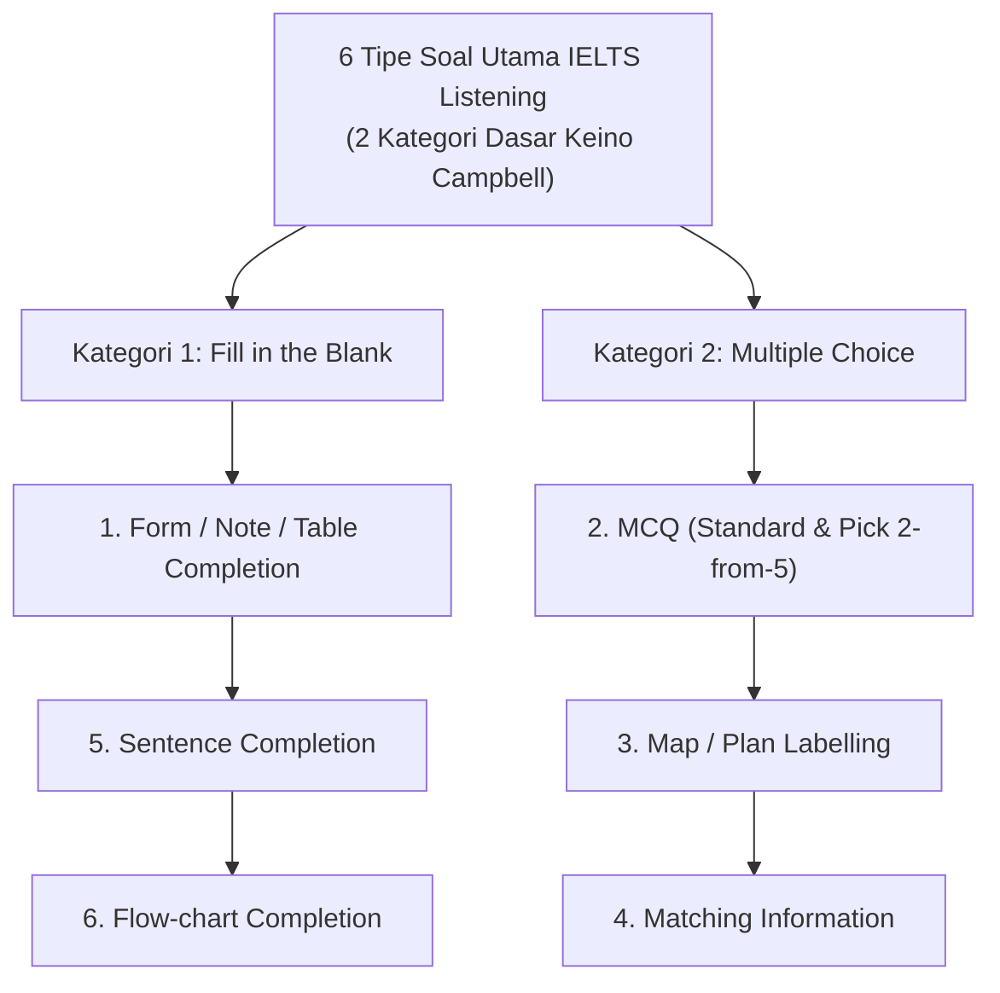

# 📋 Bab 2: Kompilasi Tipe Soal & Strategi Eksekusi IELTS Listening

| Metadata | Rincian Resmi |
| :--- | :--- |
| **Modul** | Bagian 4: Listening Section Basics and Information |
| **ID Kuliah Udemy** | `5541970` |
| **Judul Asli** | *IELTS Listening Question Types and Strategy* |
| **Instruktur** | Keino Campbell, Esq. |
| **Durasi Video** | 10 Menit 29 Detik |
| **Tipe Materi** | Video Lecture + Transkrip Verbatim Lengkap |
| **Status Pembelajaran** | ✅ Selesai (100% Reading Version) |

---

## 🎯 Ringkasan Eksekutif: 6 Tipe Soal Utama IELTS Listening

Strategi dalam IELTS Listening hanya bermanfaat jika dieksekusi secara otomatis (*muscle memory*) di bawah tekanan waktu audio satu putaran.

---

## 🧠 Matriks Strategi per Tipe Soal

| Tipe Soal | Letak Seksi Umum | Pola Soal | Strategi Kunci Keino Campbell | Modal Cepat |
| :--- | :---: | :--- | :--- | :---: |
| **1. Form / Note Completion** | Seksi 1 & 4 | Mengisi formulir, faktur, atau catatan kuliah dengan batas kata ketat. | **Prediksi Kelas Kata**: Tentukan apakah titik-titik membutuhkan *Noun*, *Adjective*, *Number*, atau *Date*. Perhatikan ejaan nama jalan dan nomor kontak. | [🔍 Buka Kartu](#mapping:ielts-listening-form-note-completion-prediction-strategy) |
| **2. Multiple Choice (MCQ)** | Seksi 2 & 3 | Pilihan tunggal (A, B, C) atau memilih 2 jawaban benar dari 5 opsi (A–E). | **Beware the Exact Word Trap**: Pilihan yang menggunakan kata persis seperti di audio sering kali adalah distraktor. Jawaban benar biasanya berupa parafrase makna. | [🔍 Buka Kartu](#mapping:ielts-listening-mcq-exact-word-trap) |
| **3. Map / Plan Labelling** | Seksi 2 | Memberi label pada denah gedung, peta desa, atau diagram mesin. | **Kunci Titik Awal (*Starting Point*)**: Cari tanda panah *"You are here"*, kompas (North/South/East/West), dan kuasai preposisi spasial (*clockwise, corridor, adjacent*). | [🔍 Buka Kartu](#mapping:ielts-listening-map-plan-labelling-strategy) |
| **4. Matching Information** | Seksi 2 & 3 | Menghubungkan daftar pembicara/opsi dengan kategori pernyataan. | **Fokus pada Opsi Pendek**: Baca dan pahami pernyataan yang lebih panjang terlebih dahulu agar saat audio berputar Anda tinggal melirik kode opsi. | [🔍 Buka Kartu](#mapping:ielts-listening-matching-information-strategy) |
| **5. Sentence Completion** | Seksi 3 & 4 | Melengkapi kalimat rumpang yang merangkum poin-poin penting kuliah. | **Grammatical Fit**: Jawaban yang disalin dari audio harus pas secara tata bahasa dengan struktur kalimat soal tanpa mengubah bentuk kata. | [🔍 Buka Kartu](#mapping:ielts-listening-sentence-completion-grammatical-fit) |
| **6. Flow-Chart Completion** | Seksi 3 & 4 | Mengisi tahapan proses berurutan (tahap 1 ➔ 2 ➔ 3). | **Follow the Signpost Words**: Dengarkan kata penanda proses: *initially, the next step involves, subsequently, finally*. | [🔍 Buka Kartu](#mapping:ielts-listening-flow-chart-completion-signpost-words) |

---

### 🗂️ Pusat Studi Interaktif: 6 Kartu Study Mapping IELTS Listening

> [!TIP]
> **🚀 Akses Langsung (*In-Place Modal*)**: Klik salah satu judul kartu di bawah ini untuk langsung membuka pembahasan pedagogis lengkap, diagram KaTeX, tabel analisis jebakan, dan tips memori kilat tanpa berpindah halaman!

1. 📝 [**Kartu 1: Form / Note Completion — Batas Kata Ketat & Prediksi Kelas Kata**](#mapping:ielts-listening-form-note-completion-prediction-strategy)
   - *Fokus Inti*: Aturan *zero tolerance word count*, rumus identifikasi 4 kelas kata kunci (*Noun, Adjective, Number, Date*), serta mitigasi jebakan koreksi diri (*self-correction*).
2. 🎯 [**Kartu 2: Multiple Choice (MCQ) — Jebakan Kata Persis (Exact Word Trap)**](#mapping:ielts-listening-mcq-exact-word-trap)
   - *Fokus Inti*: Mengapa kata persis dari audio 90% adalah distraktor jebakan, membedakan MCQ Standar vs *Pick 2-from-5*, rumus eliminasi kata absolut (*always/never*), dan validasi parafrase makna.
3. 🗺️ [**Kartu 3: Map & Plan Labelling — Kunci Titik Awal & Orientasi Kompas**](#mapping:ielts-listening-map-plan-labelling-strategy)
   - *Fokus Inti*: Menemukan titik awal (*"You are here"*), mata angin (*North/South/East/West*) vs arah relatif tubuh (*clockwise, to your left*), dan kamus preposisi tata letak spasial.
4. 🔗 [**Kartu 4: Matching Information — Strategi Opsi Pendek & Deteksi Pergeseran Opini**](#mapping:ielts-listening-matching-information-strategy)
   - *Fokus Inti*: Membagi fokus visual (fokus membaca daftar pernyataan panjang vs kode opsi pendek), mengantisipasi perubahan opini pembicara, dan strategi waktu Seksi 3.
5. ✍️ [**Kartu 5: Sentence Completion — Kesesuaian Tata Bahasa & Penanda Wacana Seksi 4**](#mapping:ielts-listening-sentence-completion-grammatical-fit)
   - *Fokus Inti*: Hukum mutlak menyalin kata persis (*exact word reproduction*), uji sintaksis celah 3 detik, dan navigasi penanda wacana kuliah monolog Seksi 4 (*signpost words*).
6. 🔄 [**Kartu 6: Flow-Chart Completion — Kotak Cek Waktu & Penanda Tahapan Sekuensial**](#mapping:ielts-listening-flow-chart-completion-signpost-words)
   - *Fokus Inti*: Menggunakan kotak tanpa nomor sebagai *timing checkpoints*, kamus kata transisi sekuensial (*initially ➔ subsequently ➔ prior to ➔ ultimately*), dan jebakan langkah wajib vs opsional.

---

## ⚡ Prinsip Urutan Kronologis (*The Chronological Order Rule*)

> ⚠️ **Hukum Mutlak Ujian**: Seluruh soal IELTS Listening disusun **100% berurutan secara kronologis** sesuai jalannya audio.
> 
> $$Soal\ 1 \longrightarrow Soal\ 2 \longrightarrow Soal\ 3 \longrightarrow Soal\ 4$$
>
> - **Aturan Melepas Soal (*Let-It-Go Protocol*)**: Jika Anda sedang menunggu jawaban nomor 14 tetapi tiba-tiba pembicara menyebutkan informasi yang cocok untuk nomor 15:
>   1. **Nomor 14 telah terlewat 100%**.
>   2. Jangan pernah melamun atau berusaha mengingat kata sebelumnya.
>   3. Tulis tebakan kilat pada nomor 14, lalu langsung fokus pada nomor 15 dan 16. Bertahan mencari nomor 14 akan membuat Anda kehilangan 3–4 nomor sekaligus.

---

## 📜 Transkrip Verbatim Lengkap per Menit (*Full Reading Transcript*)

#### ⏱️ Menit 00:00 – 00:59
> 💡 **Poin Kunci:** Pembedaan antara memahami strategi vs menerapkannya secara refleks saat audio berkecepatan tinggi berputar. Jangan hanya mengonsumsi hiburan santai; fokuskan latihan pada materi berbobot.

- **`[00:01]`** Now let's get into
- **`[00:02]`** IELTS listening question types and question strategy.
- **`[00:06]`** Let me say this about strategy.
- **`[00:08]`** Strategy is easier understood than applied.
- **`[00:13]`** So it's important to understand strategy,
- **`[00:17]`** but what you really have to work on
- **`[00:19]`** is being able to apply that strategy.
- **`[00:21]`** You can read strategy, understand the words,
- **`[00:25]`** but application is another story
- **`[00:27]`** and that's why we have this course
- **`[00:29]`** to teach you how to apply strategy.
- **`[00:33]`** Let me also say that you should never stop trying
- **`[00:38]`** to increase your English level.
- **`[00:41]`** There is a direct correlation between your English level
- **`[00:46]`** and your ability to listen and answer questions.
- **`[00:49]`** So it's not about just practicing for the exam.
- **`[00:54]`** I really encourage you in your everyday life,
- **`[00:58]`** only listen to English,

#### ⏱️ Menit 01:00 – 01:59
> 💡 **Poin Kunci:** Latihan intensif aksen non-lokal: Dengarkan aksen British, Australian, dan North American dari siaran berita BBC atau CNN agar telinga tidak kaget saat ujian asli.

- **`[01:00]`** don't listen to anything else on television, on the radio
- **`[01:05]`** and also instead of watching TV and movies,
- **`[01:09]`** listen to more podcast, any podcast that you like,
- **`[01:13]`** any topic that you like, really listen to podcasts,
- **`[01:18]`** listen to TED talks, listen to TalkRadio,
- **`[01:22]`** because you have to increase your English listening ability.
- **`[01:27]`** If you do that, you can apply the strategies
- **`[01:30]`** that we teach you very, very well on the actual exam.
- **`[01:35]`** Now let's go ahead and move forward and get started
- **`[01:37]`** with our IELTS listening strategy and question types.
- **`[01:43]`** So when it comes to question types,
- **`[01:45]`** there really are only two types.
- **`[01:46]`** It's either gonna be fill the blank or multiple choice.
- **`[01:50]`** You have your fill the blank traditional,
- **`[01:53]`** multiple choice standard or choose two.
- **`[01:56]`** You have your multiple choice for matching,
- **`[01:59]`** or it could be fill the blank for matching,

#### ⏱️ Menit 02:00 – 02:59
> 💡 **Poin Kunci:** Overview 6 tipe soal utama: Map/diagram labelling, multiple choice (standard & pick 2-from-5), note/form completion, table completion, matching information, dan sentence completion.

- **`[02:01]`** you have your map diagram question,
- **`[02:05]`** and also you can have a fill the blank type
- **`[02:07]`** that is a table or a flow chart.
- **`[02:10]`** There are really only two types of questions. That's it.
- **`[02:16]`** So first, let's move into the fill the blank question.
- **`[02:21]`** Here, what you're looking at
- **`[02:22]`** is a standard fill the blank question.
- **`[02:25]`** Now this standard fill the blank question,
- **`[02:28]`** you're going to see it in section one
- **`[02:30]`** and most likely you're also going to see it in section four.
- **`[02:34]`** Now, the only difference of course, is that in section four
- **`[02:39]`** the questions are longer, the English level is advanced.
- **`[02:43]`** So it's a more difficult question,
- **`[02:45]`** but it's the same strategy.
- **`[02:48]`** You want to first underline the question keywords
- **`[02:51]`** because those question keywords tell you
- **`[02:54]`** when an answer's being stated.
- **`[02:56]`** Please note that the questions go in order.

#### ⏱️ Menit 03:00 – 03:59
> 💡 **Poin Kunci:** Prinsip urutan pertanyaan (Chronological Sequence): Jawaban untuk nomor 1 selalu muncul sebelum nomor 2, nomor 2 sebelum nomor 3. Jika Anda mendengar jawaban nomor 3 tetapi belum menjawab nomor 2, nomor 2 dipastikan sudah terlewat!

- **`[03:00]`** You're going to hear the answer for number one,
- **`[03:02]`** then number two, then number three, then number four,
- **`[03:05]`** you'll never hear the answer for number four
- **`[03:08]`** before the answer for number two, it does not work that way.
- **`[03:13]`** Now, the basic strategy for a fill the blank question
- **`[03:18]`** is to really pay attention to the words
- **`[03:20]`** that are before and after the blank line,
- **`[03:23]`** because when you hear those words
- **`[03:26]`** or the synonym paraphrasing of those words,
- **`[03:30]`** that's when they are saying the answer.
- **`[03:33]`** So look at number three here and you see
- **`[03:36]`** before the blank line, it says "visit some"
- **`[03:39]`** or "wants to visit some."
- **`[03:42]`** When you're listening, they are probably
- **`[03:44]`** not going to say those exact same words,
- **`[03:47]`** they're going to paraphrase it.
- **`[03:49]`** So you have to hear that paraphrasing
- **`[03:51]`** and then when you hear that paraphrasing,
- **`[03:53]`** they're going to say the answer
- **`[03:55]`** and then you write the answer exactly how they say it.

#### ⏱️ Menit 04:00 – 04:59
> 💡 **Poin Kunci:** Strategi melepas soal yang terlewat: Jangan panik dan jangan bertahan mencari nomor yang hilang. Segera tebak secara cepat dan fokuskan perhatian penuh pada nomor yang sedang berjalan.

- **`[04:00]`** Exactly.
- **`[04:02]`** If you add a S, if you add a ed, most likely it is wrong.
- **`[04:08]`** Now you wanna write your answers immediately, okay,
- **`[04:11]`** because this is not a note taking exam,
- **`[04:15]`** you wanna write your answers immediately.
- **`[04:16]`** There's no time for taking notes, looking at your notes
- **`[04:19]`** and then going and writing good answers, not the TOEFL IBT.
- **`[04:23]`** Avoid certain traps.
- **`[04:25]`** If their dates or numbers, they're gonna say multiple dates,
- **`[04:28]`** multiple numbers, but only one of those
- **`[04:30]`** applies to the question key words.
- **`[04:33]`** Watch out for reordering.
- **`[04:35]`** Sometimes an answer or a question may be written
- **`[04:39]`** in the passive voice,
- **`[04:40]`** but when they're speaking in the listening passage,
- **`[04:42]`** they'll use the active voice.
- **`[04:44]`** So they'll change up the word order. Watch out for that.
- **`[04:47]`** Watch out for self-correction.
- **`[04:49]`** Sometimes a person will say something
- **`[04:52]`** and then say, "Oh, no, no, that's not it.
- **`[04:53]`** I made a mistake, the answer is this."
- **`[04:58]`** So you wanna watch for self-correction,
- **`[04:59]`** because whatever comes after the self-correction

#### ⏱️ Menit 05:00 – 05:59
> 💡 **Poin Kunci:** Taktik Multiple Choice (MCQ): Dengarkan parafrase dari pilihan jawaban. Penguji sengaja menyebutkan kata persis dari pilihan yang SALAH sebagai distraktor (distractor trap).

- **`[05:02]`** is the correct answer choice
- **`[05:04]`** and again, learn to recognize synonyms and paraphrasing.
- **`[05:12]`** Now, this is a table question.
- **`[05:13]`** Same strategy, fill the blank,
- **`[05:15]`** it goes in order from left to right.
- **`[05:18]`** So you have seven, then eight, then you drop down,
- **`[05:21]`** then you have nine and 10.
- **`[05:26]`** Here is our wonderful map question.
- **`[05:29]`** A lot of students have trouble with the map question.
- **`[05:32]`** We have a lot of lectures
- **`[05:34]`** helping you practice the map question.
- **`[05:37]`** Don't worry about it, I'm gonna help you do it.
- **`[05:42]`** Let's move on to the multiple choice questions.
- **`[05:45]`** Now, from my experience, students have more trouble
- **`[05:48]`** with the multiple choice question,
- **`[05:50]`** than they do the fill the blank.
- **`[05:52]`** The reason why is you have to deal with
- **`[05:54]`** a double application of paraphrasing and synonyms.
- **`[05:57]`** What I mean by that is this.

#### ⏱️ Menit 06:00 – 06:59
> 💡 **Poin Kunci:** Taktik Form & Note Completion: Tentukan kelas kata (Noun, Verb, Adjective, Number) yang hilang sebelum audio dimulai dengan menganalisis kata-kata sebelum dan sesudah garis kosong.

- **`[06:01]`** First you have to listen for the question keywords.
- **`[06:04]`** So you have the question keywords.
- **`[06:06]`** For example, at number 15 here,
- **`[06:09]`** experimental areas and public, all right closed,
- **`[06:13]`** those are our question keywords.
- **`[06:16]`** So you're listening for those question keywords,
- **`[06:18]`** because that's when you're going to hear the answer choice.
- **`[06:21]`** However, when you're listening,
- **`[06:23]`** they may not say those exact same words in the question,
- **`[06:26]`** they may paraphrase them, so you have to listen for that
- **`[06:29]`** and then when you hear those question keywords,
- **`[06:32]`** you're going to hear the answer choice.
- **`[06:34]`** However, you're going to have to choose
- **`[06:38]`** from A, B and C, which is a synonym or a paraphrase
- **`[06:42]`** for what they said is the answer choice.
- **`[06:45]`** So that's what makes a multiple choice question difficult,
- **`[06:49]`** is there is normally a double application
- **`[06:52]`** of paraphrasing and synonyms.
- **`[06:54]`** The correct answer will be a synonym or paraphrasing
- **`[06:59]`** of what was said in the passage.

#### ⏱️ Menit 07:00 – 07:59
> 💡 **Poin Kunci:** Teknik Map & Diagram Labelling: Identifikasi titik awal (starting point) pada denah dan perhatikan kata penunjuk arah: turn left, adjacent to, opposite, across the corridor, junction.

- **`[07:02]`** So in terms of strategy,
- **`[07:05]`** you quickly read through the questions,
- **`[07:07]`** underlining or circling the keywords in the question,
- **`[07:10]`** because you have to know when a question is being spoken.
- **`[07:14]`** Now, if you have extra time, you can go back
- **`[07:16]`** and look at the answer choices,
- **`[07:18]`** but really you have to get good at reading
- **`[07:21]`** through the answer choices while you're listening.
- **`[07:23]`** A lot of this is simultaneous.
- **`[07:25]`** Again, correct answers, we'll use synonyms and paraphrasing.
- **`[07:30]`** When they say the answer, pick it right away.
- **`[07:32]`** They don't give you time for going back
- **`[07:35]`** and taking notes and things like that.
- **`[07:37]`** So that's how we handle a multiple choice question.
- **`[07:40]`** Again, easier understood than applied,
- **`[07:45]`** but I really believe after you work with me
- **`[07:48]`** and you practice along with me in the upcoming lectures,
- **`[07:51]`** you're going to get really good at it.
- **`[07:55]`** This is our multiple choice, pick two.
- **`[07:58]`** Now, what makes this challenging is, for example,

#### ⏱️ Menit 08:00 – 08:59
> 💡 **Poin Kunci:** Analisis kata kunci (Keyword Anchoring): Garis bawahi kata benda (nouns) dan angka yang tidak mudah diparafrasekan sebagai penanda posisi audio.

- **`[08:01]`** in this first question up here where it says
- **`[08:03]`** "Which two hobbies was Thor Heyerdahl
- **`[08:06]`** very interested in as a youth?"
- **`[08:08]`** They're going to say all the answer choices.
- **`[08:11]`** They're gonna say A, B, C, D and E,
- **`[08:14]`** but only two of those answer choices
- **`[08:17]`** was he very interested in as a youth, right?
- **`[08:23]`** So you have to be,
- **`[08:24]`** you have to watch for that,
- **`[08:25]`** you have to be careful with that.
- **`[08:27]`** Sometimes also they'll use synonyms
- **`[08:29]`** for the correct answer choice,
- **`[08:31]`** you have to pick which one is a synonym for what was said.
- **`[08:34]`** So that also can make a challenge.
- **`[08:42]`** This is a multiple choice question
- **`[08:43]`** where you have the options in the box A, B, C
- **`[08:46]`** and you have the questions 15 through 20 at the bottom,
- **`[08:49]`** again, it goes in order, goes in order.
- **`[08:52]`** You in here, 15, then 16, then 17, then 18,
- **`[08:55]`** it goes in order.
- **`[08:58]`** Now, what makes this question a challenge

#### ⏱️ Menit 09:00 – 09:59
> 💡 **Poin Kunci:** Menghindari jebakan sinonim: Kata kunci di soal hampir selalu muncul dalam bentuk parafrase atau sinonim di audio (misal: annually menjadi every year, cost menjadi fee/price).

- **`[09:00]`** is for the answer choices you see in the box A, B and C,
- **`[09:05]`** they're going to use synonyms and paraphrasing
- **`[09:08]`** when they are speaking,
- **`[09:10]`** so when they're talking about using the internet,
- **`[09:13]`** they may say something like, using the internet
- **`[09:15]`** is a really good idea, I think you should do it.
- **`[09:18]`** That's a paraphrasing of it is encouraged,
- **`[09:22]`** so you'll put A as the correct answer.
- **`[09:29]`** This is another example of that question.
- **`[09:32]`** Here you can see A, B, C, D, E, F, the information,
- **`[09:35]`** you have more information to read through.
- **`[09:39]`** This is in section four, so that's what makes it difficult.
- **`[09:42]`** Answer choices are longer.
- **`[09:44]`** You look at the questions, the questions have more words
- **`[09:47]`** that makes them more difficult.
- **`[09:49]`** That's how they increase the difficulty level.
- **`[09:54]`** Alright, so coming up next,
- **`[09:56]`** I'm going to give you some listening question tips,
- **`[09:59]`** advice and suggestions and then in the next section

#### ⏱️ Menit 10:00 – 10:59
> 💡 **Poin Kunci:** Rangkuman kesiapan: Integrasikan kecepatan membaca kilat saat jeda 30 detik sebelum audio dengan respon cepat mencatat jawaban di lembar soal.

- **`[10:03]`** we're gonna move into strategy application
- **`[10:06]`** and we're going to take it section by section,
- **`[10:10]`** section one, a lot of practice,
- **`[10:13]`** section two, a lot of practice,
- **`[10:15]`** section three, a lot of practice,
- **`[10:17]`** then section four, a lot of practice
- **`[10:20]`** and then we also have an exit exam on there also,
- **`[10:23]`** so let's go ahead and move forward.
- **`[10:25]`** Thank you very much for taking this course
- **`[10:27]`** and I'll talk to you soon.

---

## 🔍 Audit Jebakan Soal Pilihan Ganda (*MCQ Distractor Anatomy*)

Penguji IELTS merancang 3 jenis distraktor umum pada soal pilihan ganda:
1. **The Keyword Echo**: Mengulang kata persis dari opsi A untuk menarik perhatian peserta, padahal konteks pembicaraannya menegasikan opsi tersebut.
2. **The Changed Mind**: Pembicara mula-mula setuju dengan opsi B, tetapi di akhir kalimat berkata *"Actually, looking at the budget, that won't work"*.
3. **The Partial Truth**: Informasi pada opsi C benar secara fakta dunia nyata, tetapi tidak disebutkan atau tidak relevan dengan pertanyaan spesifik audio.
