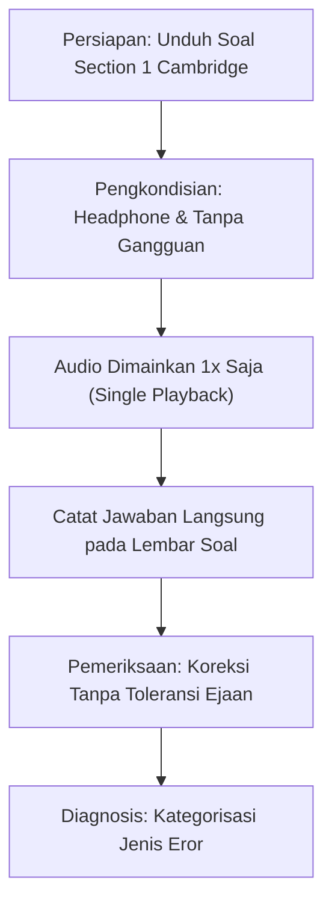

# 🎧 Bab 1: Tes Diagnostik Listening & Evaluasi Kesiapan Dasar
## (*Listening Diagnostic Test & Readiness Assessment*)

| Parameter Metadata | Rincian Resmi |
| :--- | :--- |
| **Modul** | Bagian 5: Listening Section 1 (Part 1) Strategy |
| **ID Kuliah Udemy** | `35252392` |
| **Judul Materi** | *Listening Diagnostic Test* |
| **Instruktur** | Keino Campbell, Esq. |
| **Target Keterampilan** | Pemetaan Titik Lemah (*Baseline Benchmark*), Evaluasi Kecepatan Respon, & Identifikasi Pola Eror |
| **Standar Format** | Buku Ajar Komprehensif (*6 Pedagogical Pillars*) |

---

## 🎯 1. Landasan Konseptual: Mengapa Tes Diagnostik Mutlak Diperlukan?

Dalam persiapan IELTS menuju **Band 7.0–8.5+**, kesalahan terbesar mayoritas kandidat adalah langsung melompat mengerjakan puluhan set latihan soal (*passive drilling*) tanpa mengetahui **di mana letak kebocoran poin mereka**.

Sub-tes Listening menguji kombinasi dari 3 proses kognitif simultan:
1. **Auditory Decoding**: Mendengar bunyi bahasa Inggris asli dan membedakan kata demi kata pada kecepatan normal penutur asli (*connected speech*).
2. **Real-time Comprehension**: Menangkap maksud pembicara dan memisahkan informasi relevan dari pengisi (*fillers*).
3. **Written Transcription**: Menuliskan jawaban ke lembar soal tanpa kesalahan ejaan atau pelanggaran batas kata.

$$
\text{Total Error Listening} = \text{Eror Dekoding (Pendengaran)} + \text{Eror Perangkap (Distraktor)} + \text{Eror Ejaan / Format}
$$

Tes diagnostik awal bertujuan untuk mengisolasi ketiga faktor di atas. Pada Section 1, target wajib untuk kandidat Band 7+ adalah **meraih skor minimal 9 dari 10 soal (90% akurasi)**. Karena Section 1 adalah bagian termudah, kehilangan poin di sini akan membuat target Band 7.5+ hampir mustahil tercapai di Section 3 dan 4.

---

## 🧭 2. Protokol Pelaksanaan Tes Diagnostik Mandiri

Untuk mendapatkan gambaran akurat mengenai kemampuan dasar Anda saat ini, jalankan tes diagnostik dengan mematuhi protokol ketat berikut:

### Aturan Baku Diagnostik:
* **Audio Hanya 1x Putar**: Jangan pernah menekan tombol jeda (*pause*) atau memundurkan audio (*rewind*).
* **Batas Waktu Ketat**: Berikan diri Anda hanya 30 detik untuk membaca soal sebelum audio berbunyi, dan 30 detik di akhir untuk memeriksa.
* **Gunakan Pensil / Keyboard Sesuai Tipe Ujian**:
  - Jika Anda mengambil *Paper-Based IELTS*, tulis tangan dengan pensil HB/2B.
  - Jika Anda mengambil *Computer-Delivered IELTS (CDI)*, ketik langsung pada komputer tanpa fitur *autocorrect/spellcheck*.

---

## 🔍 3. Matriks Evaluasi Skor Diagnostik Section 1

Setelah menyelesaikan 10 pertanyaan diagnostik Section 1, cocokkan skor mentah (*raw score*) Anda dengan matriks analisis berikut:

| Skor Mentah (dari 10) | Level Kesiapan | Diagnosis Utama | Rencana Intervensi Khusus |
| :---: | :---: | :--- | :--- |
| **9 – 10 / 10** | 🟢 **Siap Ujian (*Band 7.5–8.5+ Ready*)** | Pemahaman auditori dan ejaan sangat solid. Refleks pengenalan angka dan nama akurat. | Pertahankan konsistensi, latih antisipasi distraktor kompleks untuk Section 3–4. |
| **7 – 8 / 10** | 🟡 **Menengah (*Band 6.0–6.5 Plateau*)** | Menangkap sebagian besar informasi, tetapi bocor di 1–2 jebakan koreksi diri atau salah ejaan nama/angka. | Latih modul *Microskills* (Bab 2) dan *Distractor Trap Mechanics* (Bab 5). |
| **< 7 / 10** | 🔴 **Kritis (*Band 5.0–5.5 Foundation Gap*)** | Kehilangan jejak audio (*losing track*), kesulitan mengeja huruf vokal bahasa Inggris, atau lambat menulis. | Wajib memperkuat fonetik huruf/angka, latihan *shadowing*, dan pembedahan transkrip. |

---

## ⚠️ 4. Taksonomi 4 Jenis Eror Fatal pada Section 1

Saat menganalisis jawaban yang salah pada tes diagnostik, masukkan setiap kesalahan ke dalam salah satu dari 4 kategori berikut:

### Kategori A: Eror Jebakan Koreksi Diri (*Self-Correction Trap*)
* **Gejala**: Anda menuliskan informasi pertama yang disebutkan pembicara, padahal pembicara kedua meralatnya atau pembicara pertama mengoreksi dirinya sendiri.
* *Contoh Tipikal*:
  - Pembicara: *"So the session starts at 7:30... oh wait, sorry, that's the weekend schedule. On Tuesdays it's actually 8:15."*
  - Jawaban salah siswa: `7:30`
  - Jawaban tepat: `8:15`

### Kategori B: Eror Fonetik Ejaan Huruf & Angka (*Orthographic Slip*)
* **Gejala**: Pembicara mengeja nama jalan atau kode pos, namun Anda tertukar antara huruf vokal bahasa Inggris.
* *Titik Rawan Tertukar*:
  - **A** (/eɪ/) tertukar dengan **E** (/iː/) atau **I** (/aɪ/).
  - **G** (/dʒiː/) tertukar dengan **J** (/dʒeɪ/).
  - Angka belasan (*-teen*) tertukar dengan puluhan (*-ty*), misalnya `15` (/fɪfˈtiːn/) vs `50` (/ˈfɪfti/).

### Kategori C: Eror Pelanggaran Batas Kata (*Word Limit Violation*)
* **Gejala**: Instruksi menyatakan *"NO MORE THAN TWO WORDS"*, namun Anda menuliskan 3 kata (misalnya menyertakan artikel yang tidak perlu).
* *Contoh*:
  - Kunci Jawaban: `train station`
  - Tulisan Siswa: `near the train station` (3 kata) ➔ **Otomatis Diberi Nilai Nol (0)**.

### Kategori D: Eror Kehilangan Jejak (*Loss of Concentration / Signpost Miss*)
* **Gejala**: Anda menunggu jawaban untuk nomor 3, namun tiba-tiba menyadari audio sudah membahas nomor 5.
* *Penyebab*: Terpaku pada satu nomor yang tidak terdengar jelas sehingga melewatkan kata penanda wacana (*signpost keywords*) nomor berikutnya.

---

## 📋 5. Lembar Refleksi Mandiri (*Diagnostic Self-Audit*)

Setelah menyelesaikan tes diagnostik, centang daftar evaluasi berikut:

- [ ] Apakah saya mencatat jawaban langsung saat mendengar tanpa membuat coretan di kertas lain?
- [ ] Apakah seluruh jawaban saya ditulis dalam huruf kapital (*UPPERCASE*) untuk mencegah salah baca huruf?
- [ ] Apakah saya memeriksa kembali ejaan nama orang, hari, bulan, dan nama jalan?
- [ ] Berapa jumlah kesalahan saya yang murni disebabkan oleh salah eja (*spelling*) vs tidak mendengar audionya?
- [ ] Apakah skor Section 1 saya sudah mencapai target minimal $\ge 9/10$?

> [!TIP]
> **Golden Rule Section 1**: Perlakukan Section 1 sebagai lumbung nilai 10 poin penuh. Setiap kesalahan di Section 1 membutuhkan kompensasi 2x lipat lebih sulit di Section 3 atau 4 untuk mempertahankan Band 7.5.
