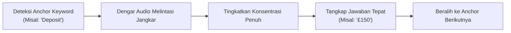

# 🎧 Bab 3: Taktik Rekognisi Soal & Prediksi Jawaban Celah
## (*Answer and Question Recognition Tactics in Section 1*)

| Parameter Metadata | Rincian Resmi |
| :--- | :--- |
| **Modul** | Bagian 5: Listening Section 1 (Part 1) Strategy |
| **ID Kuliah Udemy** | `46545365` |
| **Judul Materi** | *Listening Section 1 Answer and Question Recognition* |
| **Instruktur** | Keino Campbell, Esq. |
| **Target Keterampilan** | Pemindaian Cepat (*Pre-Reading Scan*), Prediksi Kelas Kata (*Lexical Slot Prediction*), & Identifikasi Kata Pemicu (*Trigger Keywords*) |
| **Standar Format** | Buku Ajar Komprehensif (*6 Pedagogical Pillars*) |

---

## 🎯 1. Landasan Konseptual: Mengapa Prediksi Mengalahkan Refleks Instingtif?

Kandidat yang hanya mendengarkan audio secara pasif lalu baru mencari jawaban di lembar soal akan selalu tertinggal 1–2 detik di belakang audio. Untuk meraih skor sempurna (10/10) di Section 1, Anda harus beralih dari mode pasif menjadi **mode prediktif aktif (*proactive predictive listening*)**.

Sebelum rekaman audio diputar, narator selalu memberikan waktu persiapan sekitar 30 detik:
> *"Now turn to Section 1. You have some time to look at questions 1 to 5."*

Waktu 30 detik ini adalah **faktor penentu kemenangan terbesar Anda**. Kandidat Band 7+ memanfaatkan waktu ini untuk memetakan:
1. **Batas Kata (*Word Count Restriction*)**: Berapa jumlah maksimal kata yang diizinkan?
2. **Kategori Informasi (*Target Information*)**: Apakah celah kosong memerlukan nama orang, jenis pekerjaan, nomor telepon, hari/tanggal, atau kata benda umum?
3. **Kelas Kata (*Part of Speech*)**: Apakah yang hilang berupa *Noun* (tunggal/jamak), *Adjective*, atau *Verb*?
4. **Kata Pemicu (*Trigger / Anchor Keywords*)**: Kata apa yang dicetak sebelum celah kosong yang menjadi sinyal bahwa jawaban akan segera diucapkan?

---

## 🧭 2. Matriks Prediksi Kelas Kata (*Part of Speech Prediction Grid*)

Analisis kata-kata sebelum dan sesudah celah kosong untuk menentukan bentuk kata yang wajib Anda tangkap:

| Struktur Kalimat pada Lembar Soal | Prediksi Kelas Kata | Contoh Petunjuk Kontekstual | Contoh Jawaban Masuk Akal |
| :--- | :---: | :--- | :--- |
| `Type of accommodation: ________` | **Noun (Spesifik)** | Konteks sewa rumah atau asrama mahasiswa. | `FLAT`, `APARTMENT`, `HOSTEL` |
| `Preferred day of visit: ________` | **Proper Noun (Hari/Tanggal)** | Menunjukkan waktu janji temu. | `WEDNESDAY`, `14 OCTOBER` |
| `Special requirements: a ________ room` | **Adjective (Kata Sifat)** | Berada sebelum kata benda `room`. | `QUIET`, `NON-SMOKING`, `GROUND-FLOOR` |
| `Reason for calling: to ________ a reservation` | **Verb (Kata Kerja Dasar)** | Didahului oleh partikel infinitif `to`. | `CANCEL`, `CONFIRM`, `UPGRADE` |
| `Cost per week: £ ________` | **Number (Angka)** | Didahului oleh simbol mata uang `£`. | `185`, `220.50` |

---

## ⚡ 3. Kerangka Taktis: Menemukan 'Anchor Keywords' (Jangkar Navigasi)

Penguji IELTS selalu menyertakan kata jangkar (*anchor keywords*) yang **hampir pasti diucapkan persis sama atau hanya diparafrasekan secara sederhana** dalam audio. Kata jangkar berfungsi sebagai penunjuk posisi agar Anda tidak tersesat (*losing track*).

### Aturan Memilih Kata Jangkar (*Anchor Selection Rules*):
1. **Pilih Kata Benda Konkret yang Sulit Diparafrasekan**:
   - Kata-kata seperti nama fasilitas (*swimming pool, gym, parking lot, cafeteria*), nama bulan (*January, October*), atau istilah teknis/dokumen (*passport, driver's license, deposit*) hampir selalu diucapkan tanpa parafrase.
2. **Waspadai Parafrase pada Kata Kerja & Kata Sifat**:
   - Jika lembar soal tertulis `requires assistance`, audio mungkin mengucapkannya sebagai *"needs a bit of help"*.
   - Jika lembar soal tertulis `annual subscription`, audio mungkin menyebut *"yearly membership fee"*.

---

## ⚠️ 4. Jebakan Tunggal vs Jamak (*Singular vs Plural Trap*)

Kesalahan sepele yang paling sering menggagalkan skor 10/10 adalah kelalaian mencatat akhiran jamak (`-s` atau `-es`).

### Kaidah Pengujian Tata Bahasa Celah:
Perhatikan artikel dan kata penentu (*determiners*) di depan celah kosong:
* **Ada artikel `a` atau `an`** $\implies$ Jawaban **MUTLAK TUNGGAL (*Singular Noun*)**.
  - Soal: `The applicant needs to bring a ________.`
  - Jika audio menyebut: *"You must bring references or a certificate"*, maka jawaban yang benar adalah `CERTIFICATE` (karena ada artikel `a`). Menulis `certificates` dianggap salah.
* **Ada kuantifier jamak (*many, several, various, both*)** $\implies$ Jawaban **MUTLAK JAMAK (*Plural Noun*)**.
  - Soal: `The club provides several ________.`
  - Jawaban: `ACTIVITIES` (Menulis `activity` dianggap salah).
* **Tanpa artikel untuk kata benda yang dapat dihitung (*countable*)** $\implies$ Jawaban **KEMUNGKINAN BESAR JAMAK**.
  - Soal: `Cost includes: ________ and refreshments.`
  - Jawaban: `HANDOUTS` atau `MATERIALS`.

---

## 📋 5. Lembar Evaluasi & Latihan Rekognisi Cepat

Sebelum melanjutkan ke latihan pengerjaan form-filling, uji ketelitian Anda:

- [ ] Apakah saya sudah melingkari batas kata (*NO MORE THAN X WORDS*) sebelum membaca soal nomor 1?
- [ ] Apakah saya sudah menentukan prediksi kelas kata (Noun/Verb/Adj/Number) untuk setiap nomor kosong?
- [ ] Apakah saya telah menandai minimal satu kata jangkar (*anchor keyword*) konkret untuk setiap butir soal?
- [ ] Apakah saya memeriksa kembali kesesuaian artikel (`a/an`) untuk memastikan bentuk tunggal/jamak?
- [ ] Jika saya melewatkan satu nomor, apakah saya segera melepaskannya dan beralih ke jangkar nomor berikutnya?
