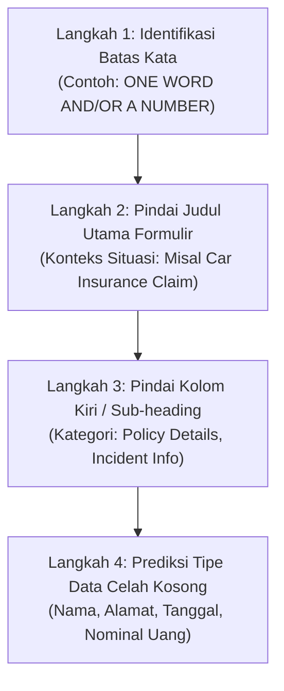

# 🎧 Bab 4: Strategi Inti Section 1 — Fase Pra-Mendengar & Prediksi Tata Letak
## (*Teaching Section 1 Strategy Part 1: Pre-Listening Mastery & Form Layout Prediction*)

| Parameter Metadata | Rincian Resmi |
| :--- | :--- |
| **Modul** | Bagian 5: Listening Section 1 (Part 1) Strategy |
| **ID Kuliah Udemy** | `55998357` |
| **Judul Materi** | *Teaching Section 1 Strategy (Part 1)* |
| **Instruktur** | Keino Campbell, Esq. |
| **Target Keterampilan** | Protokol Pra-Mendengar 30 Detik, Dekonstruksi Batas Kata, & Pemetaan Tata Letak Formulir |
| **Standar Format** | Buku Ajar Komprehensif (*6 Pedagogical Pillars*) |

---

## 🎯 1. Landasan Konseptual: Struktur Percakapan Transaksional

Section 1 dari tes IELTS Listening hampir selalu menyajikan **percakapan transaksional sosial antara dua orang**:
1. **Pemberi Layanan / Agen (*The Service Provider*)**: Resepsionis hotel, staf kantor penyewaan rumah, petugas asuransi, pemandu wisata, atau pustakawan.
2. **Pengguna Layanan / Penanya (*The Client / Inquirer*)**: Mahasiswa yang mencari akomodasi, pelanggan yang mendaftarkan asuransi kendaraan, turis yang memesan paket liburan, atau anggota baru klub kebugaran.

### Tujuan Penguji:
Penguji ingin menguji apakah Anda mampu mencatat detail faktual yang disampaikan penutur asli dalam kehidupan nyata di negara berbahasa Inggris tanpa kehilangan fokus saat ada informasi tambahan (*small talk*).

---

## 🧭 2. Protokol Taktis 30 Detik Pra-Mendengar (*The 30-Second Pre-Listening Routine*)

Saat narator mengatakan *"You have some time to look at questions 1 to 5"*, jangan membaca secara lambat kata demi kata. Lakukan **Protokol 4 Langkah Taktis**:

### 1. Dekonstruksi Batas Kata (*Word Count Decoding*):
Aturan batas kata adalah **hukum mutlak**. Pelanggaran batas kata sekecil apa pun akan langsung menghasilkan skor nol:

| Instruksi Batas Kata | Arti Hukum Penilaian | Contoh Jawaban Sah | Contoh Jawaban Gugur (Skor 0) |
| :--- | :--- | :--- | :--- |
| **ONE WORD ONLY** | Wajib tepat 1 kata. Angka tidak diperbolehkan kecuali instruksi menambahkan *AND/OR A NUMBER*. | `LIBRARY` | `IN LIBRARY` (2 kata) |
| **ONE WORD AND/OR A NUMBER** | Maksimal 1 kata dan/atau 1 angka. | `15 OCTOBER`, `OCTOBER`, `15` | `15TH OF OCTOBER` (3 kata) |
| **NO MORE THAN TWO WORDS AND/OR A NUMBER** | Maksimal 2 kata dan/atau 1 angka. | `CENTRAL TRAIN STATION`, `£250` | `NEAR THE TRAIN STATION` (4 kata) |
| **NO MORE THAN THREE WORDS** | Maksimal 3 kata. Angka dihitung sebagai kata jika ditulis huruf. | `GREEN TENNIS COURT` | `BEHIND THE GREEN TENNIS COURT` |

---

## ⚡ 3. Pemetaan Tata Letak Formulir (*Form Layout Mapping*)

Soal Section 1 biasanya tersusun dalam salah satu dari 3 tata letak berikut:

### Format 1: Formulir Pendaftaran / Klaim (*Application / Claim Form*)
* Ciri khas: Baris demi baris terpisah rapi dengan label di sebelah kiri (*Name, Address, Date of Birth, Policy Number*).
* Taktik: Fokus penuh pada label kiri. Ketika audio menyebutkan kata pada label, jawaban akan menyusul dalam 1–3 detik berikutnya.

### Format 2: Catatan Telepon / Memo Lapangan (*Phone Notes / Memo*)
* Ciri khas: Berupa daftar poin berbutir (*bullet points*) ringkas.
* Taktik: Cari kata penghubung dan sub-judul (*bullet headings*). Jika ada butir yang tidak memiliki celah kosong, gunakan butir tersebut sebagai **penunjuk waktu (*timing checkpoint*)** untuk bersiap menghadapi butir berikutnya.

### Format 3: Tabel Ringkasan Jadwal / Biaya (*Table Completion*)
* Ciri khas: Baris dan kolom (misal: *Activity, Location, Starting Time, Cost*).
* Taktik: Perhatikan arah pembacaan audio. Pada tabel IELTS, audio **hampir selalu bergerak dari kiri ke kanan, baris per baris**, mengikuti urutan nomor soal (1 ➔ 2 ➔ 3 ➔ 4).

---

## ⚠️ 4. Aturan Kata Hubung (*Hyphenated Words Rule*)

Dalam perhitungan kata resmi IELTS:
* **Kata dengan tanda hubung (*Hyphenated words*) dihitung sebagai SATU KATA**.
  - `ground-floor` = 1 kata.
  - `part-time` = 1 kata.
  - `door-to-door` = 1 kata.
* Jika batas kata adalah *ONE WORD ONLY* dan jawabannya adalah pekerjaan paruh waktu, menulis `part-time` adalah sah dan dihitung sebagai 1 kata. Menulis `part time` tanpa tanda hubung dihitung sebagai 2 kata dan akan **digugurkan**.

---

## 📋 5. Lembar Refleksi Mandiri Fase Pra-Mendengar

Sebelum audio berputar, verifikasi kesiapan Anda:
- [ ] Apakah saya sudah melingkari batas kata pada soal nomor 1–5?
- [ ] Apakah saya mengetahui konteks percakapan dari judul formulir (misal: pendaftaran klub, reservasi, laporan kehilangan)?
- [ ] Apakah saya sudah memetakan nomor-nomor yang memerlukan data angka/ejaan khusus?
- [ ] Apakah saya siap mengikuti urutan baris per baris tanpa melompat ke nomor berikutnya secara prematur?
