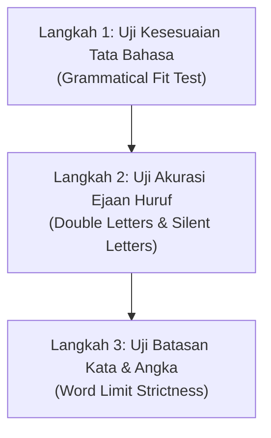

# 🎧 Bab 6: Strategi Inti Section 1 — Eksekusi Form-Filling & Regulasi Lembar Jawaban
## (*Teaching Section 1 Strategy Part 3: Form-Filling Execution & Answer Sheet Regulations*)

| Parameter Metadata | Rincian Resmi |
| :--- | :--- |
| **Modul** | Bagian 5: Listening Section 1 (Part 1) Strategy |
| **ID Kuliah Udemy** | `55998361` |
| **Judul Materi** | *Teaching Section 1 Strategy (Part 3)* |
| **Instruktur** | Keino Campbell, Esq. |
| **Target Keterampilan** | Protokol Pemeriksaan Tata Bahasa Celah, Regulasi Ejaan British vs American, Kebijakan Huruf Kapital, & Kaidah Transfer Jawaban |
| **Standar Format** | Buku Ajar Komprehensif (*6 Pedagogical Pillars*) |

---

## 🎯 1. Landasan Konseptual: Fase Review 30 Detik yang Menentukan

Di akhir Section 1, narator akan selalu menginstruksikan:
> *"That is the end of Section 1. You now have half a minute to check your answers."*

Kandidat pemula sering menggunakan 30 detik ini untuk bersantai atau melamun. Sebaliknya, kandidat **Band 7.0+** menggunakan waktu ini untuk melakukan **Audit Kualitas Celah (*Gap Quality Audit*)**: memastikan bahwa setiap jawaban yang telah dicatat memenuhi syarat sintaksis, ortografi, dan regulasi penilaian resmi Cambridge.

---

## 🧭 2. Protokol Audit Kualitas Celah 3 Langkah (*3-Step Gap Audit*)

### Langkah 1: Uji Kesesuaian Tata Bahasa (*Grammatical Fit Test*)
Baca kembali seluruh kalimat (dari awal baris hingga akhir baris) dengan memasukkan kata jawaban Anda.
* **Pertanyaan Verifikasi**: *"Apakah kalimat ini membentuk struktur bahasa Inggris yang alami dan benar secara tata bahasa?"*
* **Contoh Kasus**:
  - Lembar Soal: `The applicant was asked to provide a ________.`
  - Jika Anda menulis: `photographs` (jamak) ➔ Kalimat menjadi: *"provide a photographs"*. Ini salah secara gramatikal karena ada artikel tunggal `a`.
  - Koreksi Segera: Hapus huruf `s` menjadi `photograph`.

### Langkah 2: Uji Akurasi Ejaan (*Orthographic Verification*)
Periksa kata-kata yang rawan salah eja:
* Huruf ganda yang tertinggal: `accommodation` (dua 'c', dua 'm'), `beginning` (dua 'n'), `embarrassment` (dua 'r', dua 's').
* Huruf bisu (*silent letters*): `receipt` (ada huruf 'p'), `Wednesday` (ada huruf 'd'), `knowledge` (ada huruf 'k').

### Langkah 3: Uji Batasan Kata (*Word Limit Strictness*)
Hitung kembali jumlah kata yang Anda tulis:
* Jika batas instruksi adalah *NO MORE THAN TWO WORDS*, pastikan tidak ada kata depan (*preposition*) atau artikel (*a, an, the*) yang melebihi batas.
* `at the hospital` (3 kata) ➔ coret `at the` menjadi `hospital` (1 kata) atau `city hospital` (2 kata).

---

## 🏛️ 3. Kebijakan Resmi Ejaan: British vs American English

Penguji Cambridge menerima **kedua standar ortografi**, baik British English maupun American English, asalkan dieja dengan benar sesuai standarnya masing-masing:

| Kosakata | Ejaan British (Diterima ✅) | Ejaan American (Diterima ✅) | Catatan Penting |
| :--- | :--- | :--- | :--- |
| Warna | `COLOUR` | `COLOR` | Keduanya bernilai 1 poin penuh. |
| Pusat | `CENTRE` | `CENTER` | Keduanya bernilai 1 poin penuh. |
| Teater | `THEATRE` | `THEATER` | Keduanya bernilai 1 poin penuh. |
| Organisasi | `ORGANISATION` | `ORGANIZATION` | Keduanya bernilai 1 poin penuh. |
| Cek / Tagihan | `CHEQUE` | `CHECK` | Keduanya bernilai 1 poin penuh. |

> [!TIP]
> **Rekomendasi Instruktur**: Meskipun kedua variasi diterima, sangat disarankan untuk konsisten. Jika Anda terbiasa dengan ejaan British, pertahankan sepanjang lembar jawaban.

---

## 🔠 4. Aturan Huruf Kapital: Mengapa 'ALL CAPS' Adalah Pilihan Terbaik?

Dalam aturan ujian resmi IELTS:
1. **Huruf Kecil (*lowercase*) diperbolehkan**, asalkan huruf pertama pada nama diri (*proper nouns*) diawali dengan huruf besar (misal: `London`, `Tuesday`, `Peter`).
2. **Kelemahan Huruf Kecil**: Jika Anda lupa mengkapitalkan huruf pertama nama diri (misal menulis `london` atau `tuesday`), jawaban Anda berisiko **digugurkan** oleh sebagian penilai karena melanggar aturan kapitalisasi nama diri.
3. **Solusi Emas (*The Golden Rule*)**: Tulis **SELURUH JAWABAN ANDA DALAM HURUF KAPITAL (*ALL CAPS*)**:
   - Contoh: `LONDON`, `TUESDAY`, `SWIMMING POOL`, `APARTMENT`.
   - Menggunakan huruf kapital penuh menghilangkan 100% risiko kesalahan penentuan nama diri (*proper noun*) dan tulisan tangan yang sulit dibaca (*illegible handwriting*).

---

## 🚫 5. Regulasi Singkatan & Simbol (*Abbreviations Policy*)

| Simbol / Singkatan | Status di Lembar Jawaban | Rekomendasi Penulisan |
| :--- | :---: | :--- |
| **Satuan Waktu** (`min`, `hr`, `sec`) | ⚠️ Berisiko | Tulis utuh: `MINUTES`, `HOURS`. |
| **Satuan Jarak** (`km`, `m`, `cm`) | ✅ Diterima | Diperbolehkan: `15 KM` atau `15 KILOMETRES`. |
| **Mata Uang** (`$`, `£`, `€`) | ✅ Diterima | Tulis simbol di depan angka atau tulis nama mata uang di belakang: `£45` atau `45 POUNDS`. |
| **Bulan & Hari** (`Mon`, `Jan`) | ❌ Dilarang Singkat | **Wajib ditulis lengkap**: `MONDAY`, `JANUARY`. |

---

## 📋 6. Lembar Checklist Verifikasi Akhir Section 1

Sebelum audio berlanjut ke Section 2, pastikan Anda telah menyelesaikan:
- [ ] Seluruh 10 celah jawaban terisi (jangan biarkan ada yang kosong; buat tebakan terpelajar jika tertinggal).
- [ ] Semua nama orang, hari, bulan, dan nama tempat ditulis dalam huruf kapital yang jelas.
- [ ] Kata-kata yang diisi membentuk kalimat yang utuh dan gramatikal dengan kata sebelum/sesudahnya.
- [ ] Batas kata (*word limit*) telah dipatuhi secara ketat di semua nomor.
- [ ] Pikiran Anda sudah di-*reset* sepenuhnya untuk bersiap menghadapi Section 2 (Monolog Non-Akademis).
