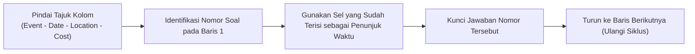

# 🎧 Bab 18: Bedah Kelas Langsung #5 — Navigasi Catatan vs Tabel Terstruktur
## (*Live Class Review Part 5: Structural Differences: Notes Completion vs Table Completion*)

| Parameter Metadata | Rincian Resmi |
| :--- | :--- |
| **Modul** | Bagian 5: Listening Section 1 (Part 1) Strategy |
| **ID Kuliah Udemy** | `31930670` |
| **Judul Materi** | *Live Class: Section 1 (Strategy and Skills Tested Review) Part 5* |
| **Instruktur** | Keino Campbell, Esq. |
| **Fokus Sesi Langsung** | Dinamika Pergerakan Mata pada Tabel, Strategi Penyelamatan Garis Audio yang Terlewat, & Pembacaan Tajuk Kategori |
| **Standar Format** | Buku Ajar Komprehensif (*6 Pedagogical Pillars*) |

---

## 🎯 1. Landasan Konseptual: Perbedaan Struktur Kognitif Antar Format

Di Section 1, penguji menyajikan soal dalam dua format struktural utama:
1. **Notes Completion (Penyelesaian Catatan Berbutir)**: Alur vertikal dari atas ke bawah.
2. **Table Completion (Penyelesaian Tabel Berkolom)**: Alur matriks dua dimensi (baris $\times$ kolom).

Kesalahan umum siswa pada format tabel adalah **pergerakan mata yang keliru**: membaca ke bawah mengikuti kolom, padahal percakapan audio hampir selalu bergerak **secara horizontal melintasi baris demi baris**.

---

## 🧭 2. Protokol Navigasi Format Tabel (Table Navigation Protocol)

### Aturan Emas Navigasi Tabel:
1. **Gunakan Sel yang Sudah Terisi sebagai Penanda Waktu (*Timing Checkpoints*)**:
   - Jika sebuah baris memiliki 4 sel dan hanya 1 sel yang memiliki celah kosong, maka 3 sel lainnya yang sudah ada teksnya adalah **pemandu navigasi Anda**.
   - Ketika audio menyebut informasi dari sel kedua, Anda tahu bahwa informasi sel ketiga (jawaban Anda) akan segera diucapkan.
2. **Tajuk Kolom Menentukan Kategori Informasi**:
   - Kolom bertajuk *Transport* $\implies$ jawaban pasti jenis transportasi (*bus, train, bicycle*).
   - Kolom bertajuk *Contact Person* $\implies$ jawaban pasti nama orang.

---

## 📋 3. Lembar Evaluasi Mandiri Navigasi Tabel

- [ ] Apakah pergerakan mata saya mengikuti arah baris (kiri ke kanan) dan bukan kolom (atas ke bawah)?
- [ ] Apakah saya memanfaatkan sel yang sudah terisi teks sebagai penanda waktu kedatangan audio?
- [ ] Apakah saya memeriksa tajuk kolom sebelum audio dimulai untuk mengetahui kategori data yang dicari?
